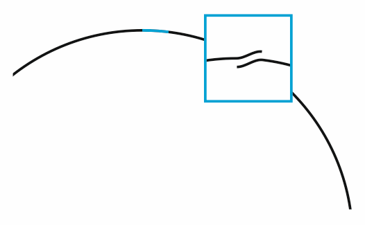

# Overcut

Для плоттерной резки. Разрывает замкнутую кривую, наращивает 1 мм в месте стыка с нахлёстом на начало кривой.

- Имя файла: `elvin_Overcut.gms`.
- Автор: **elvin-nsk**.
- Проверенно работает в версии **16**.
- Языки: **без интерфейса**.
- Распространяется **бесплатно**, код **открытый**.
- **Поддерживается автором**.

## Установка

[Стандартная](https://github.com/elvin-nsk/cdr-vba/blob/master/articles/installation.md).

## Использование

Применяется к выделенным объектам. Если будут группы - разгруппировывает, если в объекте несколько подпутей - разбивает. Далее берёт замкнутые кривые, размыкает, если первый сегмент > 1 мм, то создаёт на этом месте сегмент 1 мм, если меньше - берёт первый сегмент. Делает копию, пристыковывет к концу кривой. Таким образом, в начале кривой получается дубликат-перехлёст 1 мм.